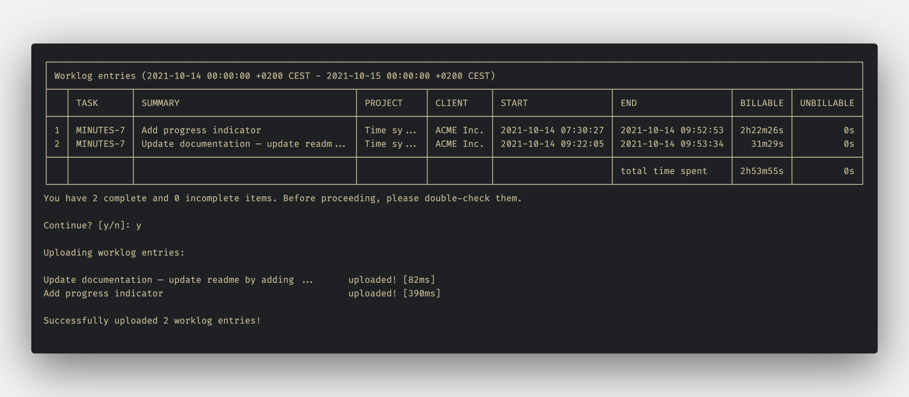

[![Contributors][contributors-shield]][contributors-url]
[![Forks][forks-shield]][forks-url]
[![Stargazers][stars-shield]][stars-url]
[![Issues][issues-shield]][issues-url]
[![MIT License][license-shield]][license-url]
[![Maintainability][maintainability-shield]][maintainability-url]
[![Coverage][coverage-shield]][coverage-url]


<br />
<div align="center">
  <h3 align="center">Minutes</h3>

  <p align="center">
    Sync worklogs between multiple time trackers, invoicing, and bookkeeping software.
    <br />
    <a href="https://gabor-boros.github.io/minutes"><strong>Explore the docs</strong></a>
    <br />
    <br />
    <a href="https://github.com/gabor-boros/minutes/issues/new?assignees=gabor-boros&labels=needs+triage&template=bug_report.md&title=%5BBUG%5D+">Bug report</a>
    ·
    <a href="https://github.com/gabor-boros/minutes/issues/new?assignees=gabor-boros&labels=enhancement&template=feature_request.md&title=%5BREQUEST%5D">Feature request</a>
  </p>
</div>

<!-- ABOUT THE PROJECT -->

## About The Project



Minutes is a CLI tool for synchronizing work logs between multiple time trackers, invoicing, and bookkeeping software to make entrepreneurs' daily work easier. Every source and destination comes with their specific flags. Before using any flags, check the related documentation.

Minutes come with absolutely **NO WARRANTY**; before and after synchronizing any logs, please ensure you got the expected result.

## Getting Started

### Prerequisites

Based on the nature of the project, prerequisites depending on what tools you are using. In case you are using Clockify as a time tracker and Tempo as your sync target, you should have an account at Clockify and Jira.

### Installation

To install `minutes`, use one of the [release artifacts](https://github.com/gabor-boros/minutes/releases). If you have `go` installed, you can build from source as well.

`minutes` has numerous flags and there will be more when other sources or targets are added. Therefore, `minutes` comes with a config file, that can be placed to the user's home directory or the config directory.

_To read more about the config file, please refer to the [Documentation](https://gabor-boros.github.io/minutes/getting-started)_

## Usage

Below you can find more information about how to use `minutes`.

```plaintext
Usage:
  minutes [flags]

Flags:
      --clockify-api-key string                set the API key
      --clockify-url string                    set the base URL
      --clockify-workspace string              set the workspace ID
      --config string                          config file (default is $HOME/.minutes.yaml)
      --date-format string                     set start and end date format (in Go style) (default "2006-01-02 15:04:05")
      --dry-run                                fetch entries, but do not sync them
      --end string                             set the end date (defaults to now)
      --force-billed-duration                  treat every second spent as billed
  -h, --help                                   help for minutes
      --round-to-closest-minute                round time to closest minute
  -s, --source string                          set the source of the sync [clockify tempo timewarrior toggl]
      --source-user string                     set the source user ID
      --start string                           set the start date (defaults to 00:00:00)
      --table-hide-column strings              hide table column [summary project client start end]
      --table-sort-by strings                  sort table by column [task summary project client start end billable unbillable] (default [start,project,task,summary])
      --tags-as-tasks                          treat tags matching the value of tags-as-tasks-regex as tasks
      --tags-as-tasks-regex string             regex of the task pattern
  -t, --target string                          set the target of the sync [tempo]
      --target-user string                     set the source user ID
      --tempo-password string                  set the login password
      --tempo-url string                       set the base URL
      --tempo-username string                  set the login user ID
      --timewarrior-arguments strings          set additional arguments
      --timewarrior-client-tag-regex string    regex of client tag pattern
      --timewarrior-command string             set the executable name (default "timew")
      --timewarrior-project-tag-regex string   regex of project tag pattern
      --timewarrior-unbillable-tag string      set the unbillable tag (default "unbillable")
      --toggl-api-key string                   set the API key
      --toggl-url string                       set the base URL (default "https://api.track.toggl.com")
      --toggl-workspace int                    set the workspace ID
      --version                                show command version
```

### Usage examples

Depending on the config file, the number of flags can change.

#### Simplest command

```shell
# No arguments, no flags, just running the command
$ minutes
```

#### Set specific date and time

```shell
# Set the date and time to fetch entries in the given time frame
$ minutes --start "2021-10-07 00:00:00" --end "2021-10-07 23:59:59"
```

```shell
# Specify the start and end date format
$ minutes --date-format "2006-01-02" --start "2021-10-07" --end "2021-10-08"
```

#### Use tags for tasks

```shell
# Specify how a tag should look like to be considered as a task
$ minutes --tags-as-tasks --tags-as-tasks-regex '[A-Z]{2,7}-\d{1,6}'
```

#### Minute based rounding

```shell
# Set the billed and unbilled time separately
# to round to the closest minute (even if it is zero)
$ minutes --round-to-closest-minute
```

### Sample config file

```toml
# Source config
source = "clockify"
source-user = "<clockify user ID>"

clockify-url = "https://api.clockify.me"
clockify-api-key = "<clockify API token>"
clockify-workspace = "<clockify workspace ID>"

# Target config
target = "tempo"
target-user = "<jira username>"

tempo-url = "https://<org>.atlassian.net"
tempo-username = "<jira username>"
tempo-password = "<jira password>"

# General config
tags-as-tasks = true
tags-as-tasks-regex = '[A-Z]{2,7}-\d{1,6}'
round-to-closest-minute = true
force-billed-duration = true

table-sort-by = [
    "start",
    "project",
    "task",
    "summary",
]

table-hide-column = [
    "end"
]

[table-column-truncates]
summary = 40
project = 10
client = 10

# Column Config
[table-column-config.summary]
widthmax = 40
```

## Supported tools

| Tool        | Use as source | Use as target |
| ----------- | ------------- | ------------- |
| Clockify    | **yes**       | upon request  |
| Everhour    | upon request  | upon request  |
| FreshBooks  | upon request  | **planned**   |
| Harvest     | upon request  | upon request  |
| QuickBooks  | upon request  | upon request  |
| Tempo       | **yes**       | **yes**       |
| Time Doctor | upon request  | upon request  |
| TimeCamp    | upon request  | upon request  |
| Timewarrior | **yes**       | upon request  |
| Toggl Track | **yes**       | upon request  |
| Zoho Books  | upon request  | **planned**   |

See the [open issues](https://github.com/gabor-boros/minutes/issues) for a full list of proposed features, tools and known issues.

## Unsupported features

The following list of features are not supported at the moment:

- Cost rate sync
- Hourly rate sync
- Estimate sync
- Multiple source and target user support

## Contributing

Contributions are what make the open source community such an amazing place to learn, inspire, and create. Any contributions you make are **greatly appreciated**.

If you have a suggestion that would make this tool better, please fork the repo and create a pull request. You can also simply open an issue.
Don't forget to give the project a star!

1. Fork the Project
2. Create your Feature Branch (`git checkout -b github-username/amazing-feature`)
3. Commit your Changes (`git commit -m 'feat(new tool): add my favorite tool as a source`)
4. Push to the Branch (`git push origin github-username/amazing-feature`)
5. Open a Pull Request

<!-- MARKDOWN LINKS & IMAGES -->

[contributors-shield]: https://img.shields.io/github/contributors/gabor-boros/minutes.svg
[contributors-url]: https://github.com/gabor-boros/minutes/graphs/contributors
[forks-shield]: https://img.shields.io/github/forks/gabor-boros/minutes.svg
[forks-url]: https://github.com/gabor-boros/minutes/network/members
[stars-shield]: https://img.shields.io/github/stars/gabor-boros/minutes.svg
[stars-url]: https://github.com/gabor-boros/minutes/stargazers
[issues-shield]: https://img.shields.io/github/issues/gabor-boros/minutes.svg
[issues-url]: https://github.com/gabor-boros/minutes/issues
[license-shield]: https://img.shields.io/github/license/gabor-boros/minutes.svg
[license-url]: https://github.com/gabor-boros/minutes/blob/main/LICENSE
[maintainability-shield]: https://api.codeclimate.com/v1/badges/316725f57830f48733e8/maintainability
[maintainability-url]: https://codeclimate.com/github/gabor-boros/minutes/maintainability
[coverage-shield]: https://api.codeclimate.com/v1/badges/316725f57830f48733e8/test_coverage
[coverage-url]: https://codeclimate.com/github/gabor-boros/minutes/test_coverage