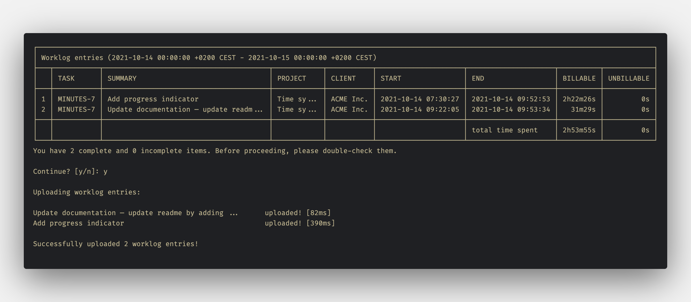

  <h3 align="center">Minutes</h3>

  

    Sync worklogs between multiple time trackers, invoicing, and bookkeeping software.
     
    <a href="https://github.com/gabor-boros/minutes/issues/new?assignees=gabor-boros&labels=needs+triage&template=bug_report.md&title=%5BBUG%5D+">Bug report</a>
    ·
    <a href="https://github.com/gabor-boros/minutes/issues/new?assignees=gabor-boros&labels=enhancement&template=feature_request.md&title=%5BREQUEST%5D">Feature request</a>
  

  

    
    
    
    
    
    
    
  

---

Charging by the hour is one of the most common ways to invoice a client. Some companies or clients specify the time tracking tool to use, though it usually won't fit your own workflows. This even gets more complicated and cumbersome, when the invoices should contain the tasks you spent time on.

Minutes is a CLI tool, primarily made for entrepreneurs and finance people, to help their daily work by synchronizing worklogs from a `source` to a `target` software. The `source` can be your own time tracking tool you use, let's say [Tempo](https://tempo.io/), while the `target` is a bookkeeping software, like [Zoho Books](https://books.zoho.com).

## Key features

_Some features may vary depending on the `source` and `target`. For more information, please refer to their documentation._

- Customize the date time format used for fetching entries
- Set a specific start and end date to query entries
- Force every second spent to be billable[^1]
- Treat tags attached to an entry as tasks you spent time on[^2]
- Round billable and unbillable seconds to the closest minute per entry[^3]
- Customizable table output before uploading

[^1]: It can be useful if the `source` does not support billable time, while the `target` does.
[^2]: When you need to split time across entries or your `source` tool does not support tasks, it comes handy to tag entries.
[^3]: Rounding rules are the following: if you spent >=30 seconds on a task, it will be treated as 1 minute, otherwise 0 (zero).

For usage examples and configuration options, please check the [Getting Started](https://gabor-boros.github.io/minutes/getting-started) and [Configuration](https://gabor-boros.github.io/minutes/configuration) documentation.

## Supported platforms

The following platforms and tools are supported. If you miss your favorite tool, please send a pull request with the implementation, or file a new [feature request](https://github.com/gabor-boros/minutes/issues).

| Tool        | Use as source | Use as target |
| ----------- | ------------- | ------------- |
| Clockify    | **yes**       | upon request  |
| Everhour    | upon request  | upon request  |
| FreshBooks  | upon request  | **planned**   |
| Harvest     | upon request  | upon request  |
| QuickBooks  | upon request  | upon request  |
| Tempo       | **yes**       | **yes**       |
| Time Doctor | upon request  | upon request  |
| TimeCamp    | upon request  | upon request  |
| Timewarrior | **yes**       | upon request  |
| Toggl Track | **planned**   | upon request  |
| Zoho Books  | upon request  | **planned**   |

## Versioning

Minutes adheres to [Semantic Versioning](https://semver.org/spec/v2.0.0.html).

## Disclaimer

!!! warning
    
    Minutes comes with absolutely **no warranty**.
    When money comes into the picture, everyone should be more careful what they are doing. Before and after synchronizing any logs to the `target`, **make sure the entries displayed on the screen matching the `source` entries**.
